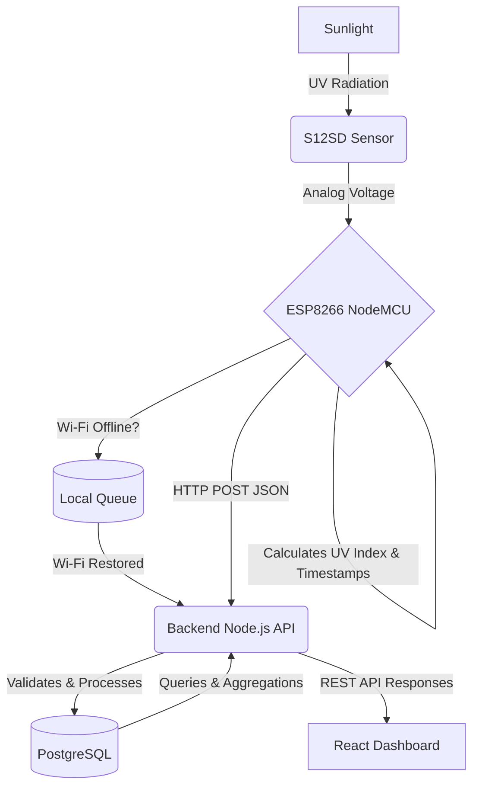

# System Architecture

## 1. Overview
The SunSense backend operates as a central RESTful API connecting the ESP8266 IoT hardware (via Wi-Fi) with the React-based frontend dashboard. The server is built with Node.js and Express, utilizing PostgreSQL for persistent storage.

## 2. Component Communication & Data Flow

## 3. Live Updates (Phase 6 Integration)
The system employs a hybrid architecture for communication with the frontend Dashboard:
- **REST APIs**: Used for static, transactional, or historical data. This includes authentication, history, settings, analytics, and device management.
- **WebSockets (or Server-Sent Events)**: Reserved for real-time telemetry. In Phase 6, WebSockets will be integrated to push live UV readings, live dashboard updates, live alerts, live battery updates, and live device status directly to the React frontend as soon as they are ingested from the ESP8266.

## 4. Responsibilities

### ESP8266 Hardware
- Read S12SD analog data and calculate UV Index.
- Stamp each reading with an accurate timestamp.
- Transmit readings to the backend via HTTP POST.
- Transmit periodic heartbeats containing telemetry (battery, Wi-Fi RSSI).
- Queue readings locally if offline.
- Upload queued readings upon reconnection (oldest first).

### Node.js + Express Backend
- **Authentication**: Authenticate users (JWT) and devices (API Keys).
- **Data Ingestion**: Validate, deduplicate, and store incoming UV readings.
- **Business Logic**: Analyze readings to generate Exposure Sessions, UV Dose (SED), Risk, Burn Time, averages, and peaks.
- **Sunscreen Tracking**: Store SPF application and track expiration.
- **Smart Alerts**: Evaluate rules on incoming data and generate alerts dynamically.
- **Data Serving**: Provide clean REST endpoints (and eventually WebSockets) for the frontend.

### React Frontend
- Present Data (Dashboard, Analytics, History).
- Manage user interactions (Sunscreen Tracker, Settings, Device Management).
- Display Smart Alerts in real-time.

## 5. Authentication Flow
- **User Flow**: Client sends email/password -> Server verifies -> Server returns JWT Access & Refresh tokens.
- **Device Flow**: ESP8266 sends `x-device-id` and `x-api-key` headers -> Server verifies device ownership and authenticity.

## 6. Offline Synchronization
- Handled gracefully by the hardware queue and a dedicated bulk-ingest endpoint on the backend.
- Backend prevents duplicate readings via unique composite keys (DeviceID + Timestamp).
- Upon successful insertion, the backend sends a 200 OK acknowledgement, instructing the ESP8266 to drop the local cache.
