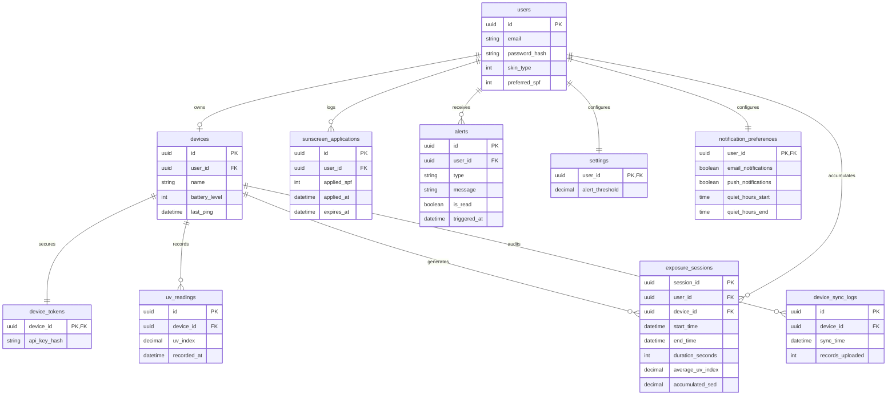

# Entity Relationship Diagram

## Relationship Rules
- **Cascade Deletes**: Deleting a User cascades to Devices, Settings, Notification Preferences, Alerts, Exposure Sessions, and Sunscreen Applications.
- **One-to-Many**: One Device has many UV Readings and Exposure Sessions.
- **One-to-One**: Users have strictly one Device (MVP Hard Limit), one Settings profile, and one Notification Preferences profile. Devices have exactly one Device Token.
