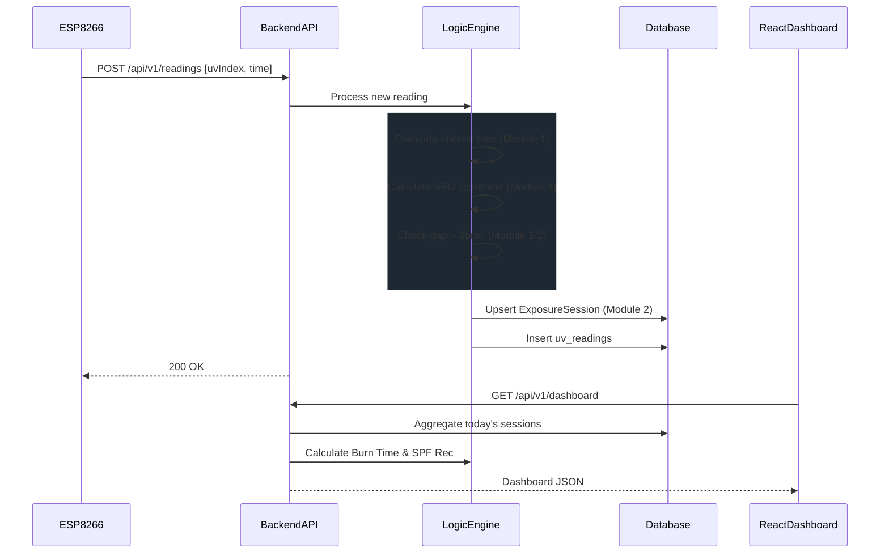
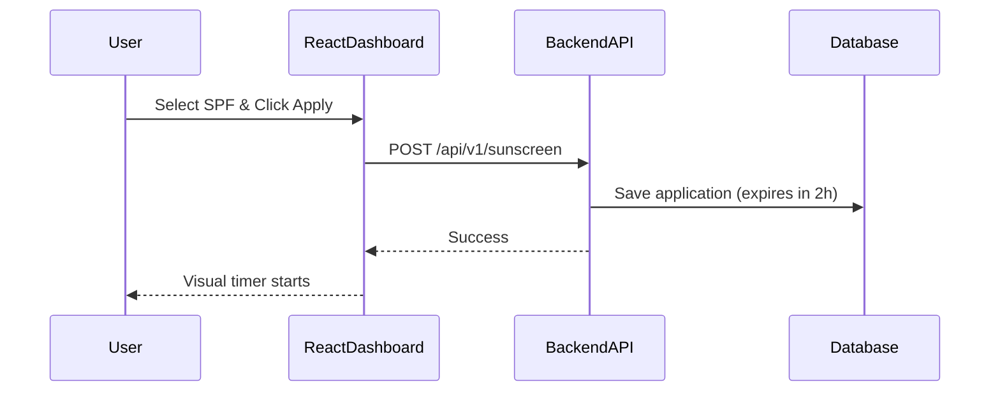

# Module 11: Business Logic Flow

## Purpose
Visualize the flow of data from the hardware sensor to the final dashboard UI.

## Flow: Sensor Reading -> Dashboard

```mermaid
sequenceDiagram
    participant ESP8266
    participant BackendAPI
    participant LogicEngine
    participant Database
    participant ReactDashboard

    ESP8266->>BackendAPI: POST /api/v1/readings [uvIndex, time]
    BackendAPI->>LogicEngine: Process new reading
    
    rect rgb(30, 40, 50)
    LogicEngine->>LogicEngine: Calculate interval time (Module 1)
    LogicEngine->>LogicEngine: Calculate SED increment (Module 3)
    LogicEngine->>LogicEngine: Check gap > 15m? (Module 1/2)
    end
    
    LogicEngine->>Database: Upsert ExposureSession (Module 2)
    LogicEngine->>Database: Insert uv_readings
    BackendAPI-->>ESP8266: 200 OK

    ReactDashboard->>BackendAPI: GET /api/v1/dashboard
    BackendAPI->>Database: Aggregate today's sessions
    BackendAPI->>LogicEngine: Calculate Burn Time & SPF Rec
    BackendAPI-->>ReactDashboard: Dashboard JSON
```

## Flow: Sunscreen Application

```mermaid
sequenceDiagram
    participant User
    participant ReactDashboard
    participant BackendAPI
    participant Database

    User->>ReactDashboard: Select SPF & Click Apply
    ReactDashboard->>BackendAPI: POST /api/v1/sunscreen
    BackendAPI->>Database: Save application (expires in 2h)
    BackendAPI-->>ReactDashboard: Success
    ReactDashboard-->>User: Visual timer starts
```
